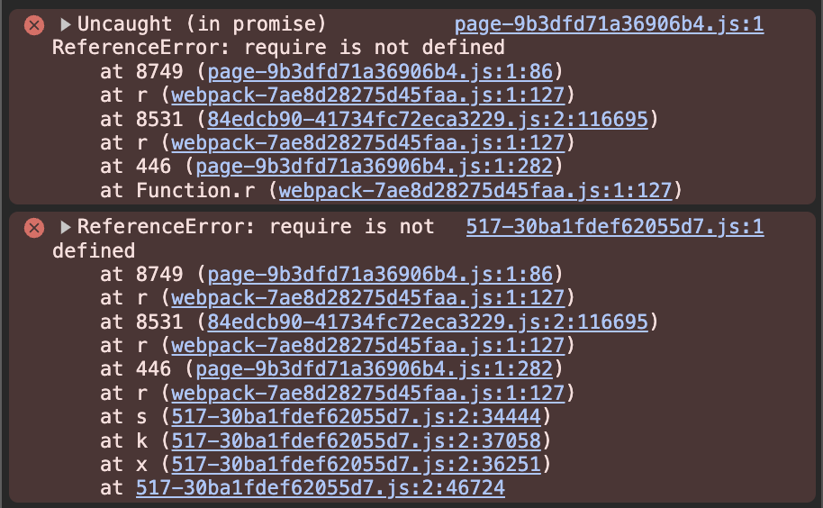

## blocklock-js

`blocklock-js` is a TypeScript library that simplifies generating encrypted data off-chain for use with the dcrypt network. It allows developers to securely encrypt data tied to a user-defined condition, e.g., a future block height. This encrypted payload can then be referenced in on-chain timelock encryption requests via smart contracts. Once the specified block is mined, the decryption key is automatically delivered to the smart contract via a callback, enabling conditional data access on-chain.

The library also enables developers to track the status of a conditional encryption request.

### On-Chain Integration

Solidity interfaces and associated documentation can be found in the [blocklock-solidity](https://github.com/randa-mu/blocklock-solidity.git) repository.

#### Smart Contract Addresses

**BlocklockSender Proxy**

A lightweight proxy contract that enables upgradeability for the `BlocklockSender` implementation. It delegates all calls to the underlying implementation and serves as the primary interface for user interaction.

| Network                    | Address                                                                                                                     |
|----------------------------|-----------------------------------------------------------------------------------------------------------------------------|
| Filecoin Mainnet           | [0x34092470CC59A097d770523931E3bC179370B44b](https://filfox.info/en/address/0x34092470CC59A097d770523931E3bC179370B44b)     |
| Filecoin Calibration Testnet | [0xF00aB3B64c81b6Ce51f8220EB2bFaa2D469cf702](https://calibration.filfox.info/en/address/0xF00aB3B64c81b6Ce51f8220EB2bFaa2D469cf702) |
| Base Sepolia               | [0x82Fed730CbdeC5A2D8724F2e3b316a70A565e27e](https://sepolia.basescan.org/address/0x82Fed730CbdeC5A2D8724F2e3b316a70A565e27e) |
| Polygon PoS                | [0x82Fed730CbdeC5A2D8724F2e3b316a70A565e27e](https://polygonscan.com/address/0x82Fed730CbdeC5A2D8724F2e3b316a70A565e27e)    |
| Optimism Sepolia           | [0xd22302849a87d5B00f13e504581BC086300DA080](https://sepolia-optimism.etherscan.io/address/0xd22302849a87d5B00f13e504581BC086300DA080)    |
| Arbitrum Sepolia           | [0xd22302849a87d5B00f13e504581BC086300DA080](https://sepolia.arbiscan.io/address/0xd22302849a87d5B00f13e504581BC086300DA080)    |
| Avalanche (C-Chain) Testnet           | [0xd22302849a87d5B00f13e504581BC086300DA080](https://testnet.snowtrace.io/address/0xd22302849a87d5B00f13e504581BC086300DA080)    |
| Sei Testnet           | [0xd22302849a87d5B00f13e504581BC086300DA080](https://seitrace.com/address/0xd22302849a87d5B00f13e504581BC086300DA080?chain=atlantic-2)    |


**Other contract addresses**
You should only need the `BlocklockSender` proxy above, but a full list of contract addresses can be found in the [solidity repo's README](https://github.com/randa-mu/blocklock-solidity).


### Installation

To install the library, install the latest version using:

```sh
npm install blocklock-js
```


### Usage Example

#### Prerequisites

* [ethers](https://www.npmjs.com/package/ethers) for wallet setup and message encoding.
* Node.js v22+

#### Setup

1. Create a `.env` file or set the following environment variables, e.g., for Filecoin mainnet:

```bash
RPC_URL=https://your-rpc-url
PRIVATE_KEY=your_private_key
```

2. Install dependencies:

```bash
npm install
```


#### Usage example

This example demonstrates encrypting a `uint256` value and using the Ciphertext and condition bytes in a user smart contract that implements the `createTimelockRequestWithDirectFunding` function to create a timelock encryption request on-chain. An example use case is a sealed-bid auction where bid amounts are encrypted and only decrypted at the auction ending block number.

The example user smart contract source code can be found [here](https://github.com/randa-mu/blocklock-solidity/blob/main/src/mocks/MockBlocklockReceiver.sol).

This script shows how to encrypt data with a future block as a condition


```ts
import { createProvider, Blocklock, encodeCiphertextToSolidity, encodeCondition } from "blocklock-js"
import { Wallet, Provider, NonceManager, ethers, getBytes } from "ethers"
import { MockBlocklockReceiver__factory } from "../types"; // Users' solidity contract TypeScript binding

async function main() {
  const rpc = createProvider(process.env.RPC_URL || "")
  const wallet = new NonceManager(new Wallet(process.env.PRIVATE_KEY || "", rpc))
  // Create a Blocklock instance for the Filecoin mainnet
  const blocklock = Blocklock.createFilecoinMainnet(wallet)

  // Value to encrypt (4 ETH as uint256)
  const msg = ethers.utils.parseEther("4");
  const plaintext = Buffer.from(msg)
  const currentBlock = await rpc.getBlockNumber()
  const targetBlock = BigInt(currentBlock + 5)

  console.log(`Encrypting for block ${targetBlock} (current: ${currentBlock})`)
  const ciphertext = await blocklock.encrypt(plaintext, targetBlock)

  // User contract
  const mockBlocklockReceiver = MockBlocklockReceiver__factory.connect("user blocklcok receiver contract address", wallet);

  // Generate the timelock encryption condition bytes string
  const conditionBytes = encodeCondition(targetBlock);
  // Amount of gas users callback function is expected to consume, i.e., the function that will be called with the decryption key
  const callbackGasLimit = 500_000;

  // Compute the request price to pay for the direct funding request
  const requestPrice = await blocklock.calculateRequestPriceNative(callbackGasLimit);

  // Call `createTimelockRequestWithDirectFunding` on the user's contract 
  // for a direct or ad hoc funding request with the following parameters:
  // uint32 callbackGasLimit, 
  // bytes calldata condition and,
  // TypesLib.Ciphertext calldata encryptedData
  const tx = await mockBlocklockReceiver
    .connect(wallet)
    .createTimelockRequestWithDirectFunding(callbackGasLimit, conditionBytes, encodeCiphertextToSolidity(ciphertext), 
    {value: requestPrice});
  // Note: for subscription-based funding, 
  // use createTimelockRequestWithSubscription instead.

  const receipt = await tx.wait(1);

  if (!receipt) {
    throw new Error("Transaction has not been mined");
  }

  console.log("Timelock request created!");
}

main().catch((error) => {
  console.error("Error:", error);
});
```

#### How It Works
1. Encoding and Encryption:

* Use blocklock-js to:

  * Create a provider and signer using Wallet and NonceManager.

  * Initialize a Blocklock instance for your target network (e.g., Filecoin mainnet).

  * Prepare the message to encrypt (e.g., 4 ETH encoded as a uint256).

  * Select a future block height as the decryption condition.

  ```ts
  const msg = ethers.utils.parseEther("4");
  const plaintext = Buffer.from(msg);
  const currentBlock = await rpc.getBlockNumber();
  const targetBlock = BigInt(currentBlock + 5);

  const ciphertext = await blocklock.encrypt(plaintext, targetBlock);
  const conditionBytes = encodeCondition(targetBlock);
  ```

2. On-Chain Interaction:  

    * Use your own smart contract (e.g., `MockBlocklockReceiver`) to create a timelock encryption request.
    * Call `createTimelockRequestWithDirectFunding`, which:

      * Stores the encrypted data (Ciphertext) and decryption condition on-chain via the `BlocklockSender` contract.

      * Funds the request by paying the `requestPrice` via the transaction.

      * Generates a unique request ID.Call the appropriate function in the user contract with the encrypted data and the chain height used during off-chain encryption. 

      ```ts
      const callbackGasLimit = 500_000;
      
      const requestPrice = await blocklock.calculateRequestPriceNative(callbackGasLimit);

      await mockBlocklockReceiver.createTimelockRequestWithDirectFunding(
        callbackGasLimit,
        conditionBytes,
        encodeCiphertextToSolidity(ciphertext),
        {value: requestPrice}
      );
      ```

3. Automatic Decryption and Callback:
  * Once the specified condition is met (e.g., target block is mined):

    * The `BlocklockSender` contract receives the decryption key from the dcipher Threshold Network.

    * It automatically triggers a callback to the users contract with the key.

    * The users contract can optionally call decrypt to recover the original message on-chain.


### Common Errors

#### Webpack Configuration

When using the library in web applications, there might be webpack errors such as the one displayed below:




To resolve this error, one solution is to update your `next.config.ts` configuration file if you use one with similar configurations for webpack below. 

```ts
import type { NextConfig } from "next";

const nextConfig: NextConfig = {
  /* config options here */
   webpack: (config) => {
     config.externals.push({
       'node:crypto': 'crypto',
     });
     return config;
  },
};

export default nextConfig;
```

In the library's Webpack configuration, the following setting is used:

```javascript
externals: {
    'node:crypto': 'commonjs crypto',
}
```

This configuration tells the bundler **not to include the `crypto` module** in the final bundle. Instead, it treats `'node:crypto'` as an **external dependency** and expects it to be available in the runtime environment. `'commonjs crypto'` ensures that the module is required using the **CommonJS format**, making it compatible with Node.js. This ensures compatibility with environments where the `crypto` module is natively available.


### Licensing

This library is licensed under the MIT License which can be accessed [here](LICENSE).

### Contributing

Contributions are welcome! If you find a bug, have a feature request, or want to improve the code, feel free to open an issue or submit a pull request.

### Acknowledgements

Special thanks to the Filecoin Foundation for supporting the development of this library.
